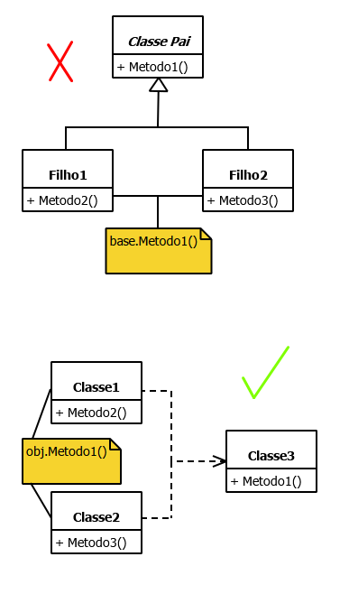
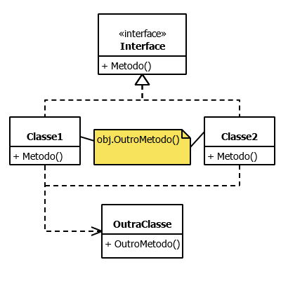

<!--:::{
  "post_title": "POO: Herança versus Composição",
  "post_description": "Guia rápido para decidir entre herança e composição na Programação Orientada a Objetos.",
  "post_created_at": "Sun Jun 08 2025 12:14:01 GMT-0300 (Horário Padrão de Brasília)"
}:::-->

## Como decidir

Usar **herança** quando precisar de:
- reaproveitamento de código
- polimorfismo

Usar **composição** quando precisar de:
- reaproveitamento de código

Usar uma **interface** quando precisar de:
- polimorfismo

**Ou seja, a herança é bem vinda quando, e somente quando, as duas necessidades forem verdade. Do contrario, prefira sempre composição.**

É importante ressaltar que a herança pode levar a um acoplamento mais forte entre as classes, o que pode dificultar a manutenção e evolução do código.
A composição, por outro lado, promove um acoplamento mais fraco, permitindo maior flexibilidade e reutilização de componentes. Por isso, muitos autores recomendam a composição como uma abordagem preferencial na Programação Orientada a Objetos.

## Exemplo

No exemplo da imagem, a herança não é justificada porque nenhuma das classes herdeiras sobrescreve o método da classe principal (polimorfismo), apenas é reaproveitado o `Metodo1()` (reaproveitamento de código).
Nesse caso, como apenas um dos requisitos é preenchido, é melhor usar composição.

Há também a abordagem de não usar herança mesmo em casos que preencham os dois requisitos. Pois ambos podem ser satisfeitos através da combinação de interfaces e composição.

## Referência
[Only Use Inheritance If You Want Both of These - by Christopher Okhravi](https://www.youtube.com/watch?v=C3B5IIlt4-0)