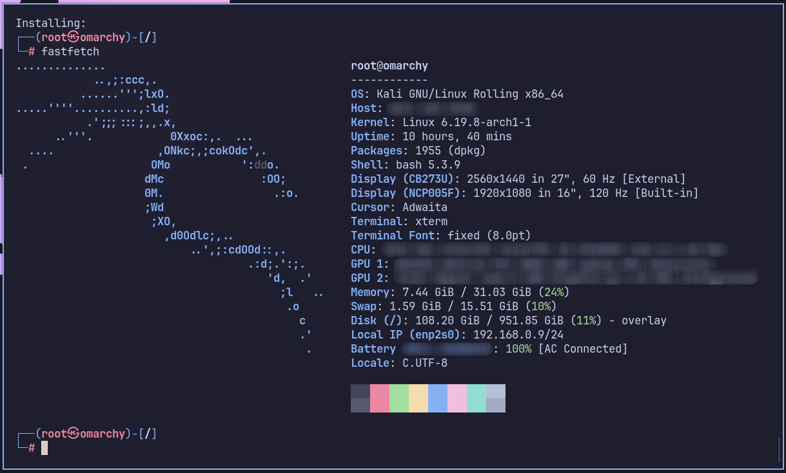

<!--:::{
  "post_title": "Kali Linux no Docker",
  "post_description": "Como configurar um container do Kali Linux",
  "post_created_at": "Fri Mar 20 2026 18:22:25 GMT-0300 (Brasilia Standard Time)"
}:::-->



## Container vs Máquina Virtual - escolha pessoal

Trabalhar com o Kali em um container tem suas vantagens e desvantagens, e a maioria delas é as mesmas que você encontraria em qualquer situação semelhante (performance, isolamento de ambiente, etc). E, para mim, os pontos principais que me levaram a optar pelo container foram dois:

1. **Aproveitar o meu workflow já configurado**. Utilizo, até o momento da escrita desse post, Hyprland como gerenciador de janelas. Utilizar o Kali em um container sem ambiente gráfico me poupa de me adaptar ao *workflow* da distro ou de ter o trabalho de adaptar ele ao meu. 

2. **Ambientes gráficos, nesse caso, não me fazem falta**. Algumas ferramentas no Kali, como Wireshark e Burp Suite, já fazem parte do meu dia a dia independente do estudo a parte que faço sobre segurança da informação e estão instaladas diretamente no meu SO host.

## Download da imagem e configuração do container

A imagem Docker do Kali não é nenhuma "gambiarra; é oficial e pode ser encontrada [aqui](https://www.kali.org/docs/containers/official-kalilinux-docker-images/).

Como sugerido no próprio portal, a imagem recomendada é a `kali-rolling`.

```bash
docker pull kalilinux/kali-rolling
```

Após o *pull* da imagem, o container já pode ser iniciado. Porém, aqui algumas configurações se fazem necessárias para o uso mais conveniente do sistema.

Antes de iniciar o container, recomendo que rode o seguinte comando para criar o volume em que as configurações feitas no Kali sejam persistidas:

```bash
docker volume create kali_data
```

O seguinte comando cria, inicia o container e em seguida já dá acesso ao Kali pelo `bash`:

```bash
docker run -it \
 --name kali-lab \
 --network host \
 -v kali_data:/root \
 --cap-add=NET_ADMIN \
 --cap-add=NET_RAW \
 kalilinux/kali-rolling /bin/bash
```
- `--network host`: O container compartilha a interface de rede diretamente com a sua máquina real. Essencial para ataques de rede, *sniffing*, *scanners* e conexão com *reverse shell*.
- `--cap-add=NET_ADMIN`: Permite configurar interfaces de rede.
- `--cap-add=NET_RAW`: Permite que o Nmap crie pacotes "crus" para *scans* furtivos.

A documentação do Kali informa que a imagem não possui as ferramentas padrões instaladas, e, portanto, é necessário executar o comando abaixo no `bash` do container:

```bash
apt update && apt -y install kali-linux-headless
```

Acompanhe a instalação até o final.

Seu Kali está pronto, e mesmo que você saia do container ou feche o terminal, basta iniciá-lo novamente com `docker start kali-lab` e acessá-lo com `docker exec -it kali-lab /bin/bash`.

## Melhoria do workflow 

Pra facilitar a vida, uma configuração **opcional para quem usa Linux** é adicionar uma função no `~/.bashrc` que combina os comandos *start* e o *exec -it*. Dessa forma é mais simples iniciar o ambiente e abrir quantos terminais forem necessários dentro do container.

```bash
kali() {
    # Verifica se o container existe
    if [ "$(docker ps -aq -f name=kali-lab)" ]; then
        # Se estiver parado, inicia
        if [ ! "$(docker ps -q -f name=kali-lab)" ]; then
            echo "Iniciando kali-lab..."
            docker start kali-lab
        fi
        # Entra no container
        docker exec -it kali-lab /bin/bash
    else
        echo "Erro: O container 'kali-lab' não existe. Execute o comando 'docker run' primeiro."
    fi
}
```
Após essa função adicionada no arquivo `~/.bashrc`, basta executar `kali` no terminal para acessar o ambiente.

```bash
~ ❯ kali
┌──(root㉿omarchy)-[/]
└─# bom hacking!
```

Feito!