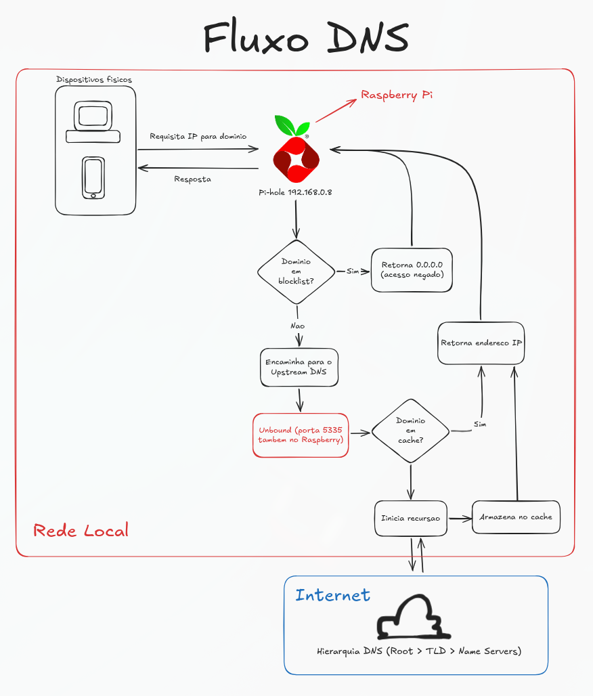
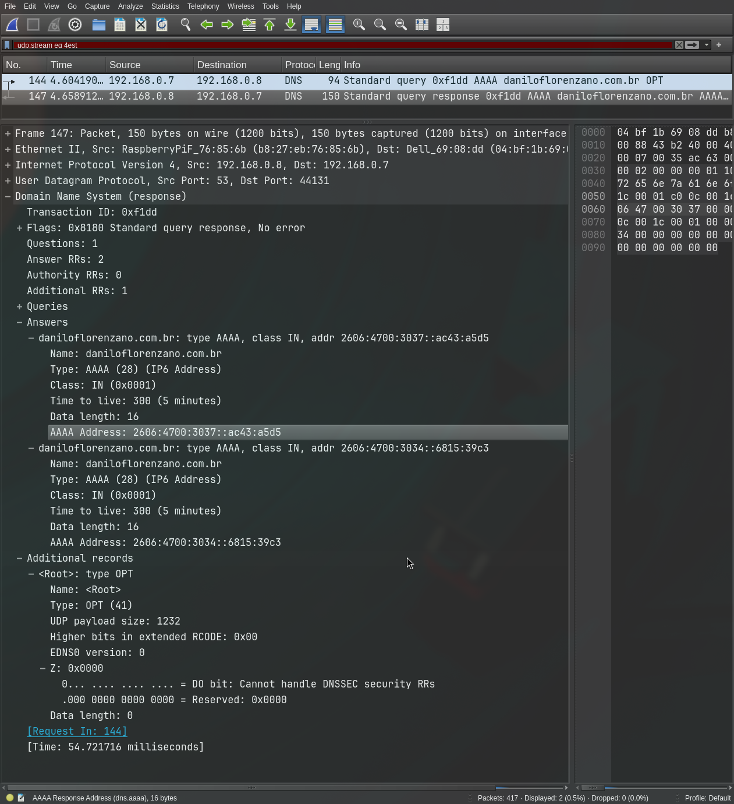

<!--:::{
  "post_title": "Pi-hole e Unbound: privacidade com adblock na rede e DNS recursivo",
  "post_description": "Pi-hole, Unbound, DNS recursivo e privacidade - funcionamento na prática",
  "post_created_at": "Sun Apr 26 2026 19:33:43 GMT-0300 (Brasilia Standard Time)"
}:::-->

## Conclusão

**Pi-hole** é um serviço conhecido e amplamente utilizado por quem tem o hábito de hospedar serviços em sua rede local (prática conhecida como self-host ou home lab).
Junto ao Pi-hole, que atua como um bloqueador de anúncios, é comum utilizar o **Unbound** como servidor DNS upstream para substituir os populares como Google, Cloudflare, etc.

Essa combinação é interessante para quem preza pela privacidade e busca retirar do ISP e das big techs um pouco do controle sobre como navega na internet.

## Funcionamento

A instalação dos serviços é simples e amplamente documentada, mas o funcionamento talvez seja um pouco abstrato demais para algumas pessoas. Portanto, a partir dessa documentação que fiz para meu próprio *home lab*, trago uma tentativa de facilitar a compreensão sobre o caminho que a requisição por um endereço faz.



Com **Wireshark**, por exemplo, é possível ainda verificar a comunicação acontecendo entre o dispositivo físico e o servidor Pi-hole.



E no servidor é possível consultar a quem o Unbound está perguntando e de fato confirmar que ele vai na raiz da internet e usa da recursão para descobrir o IP do domínio requisitado.

```bash
pi@raspberrypi:~ $ dig daniloflorenzano.com.br @127.0.0.1 +trace

; <<>> DiG 9.16.50-Raspbian <<>> daniloflorenzano.com.br @127.0.0.1 +trace
;; global options: +cmd
.                       86199   IN      NS      g.root-servers.net.
.                       86199   IN      NS      h.root-servers.net.
.                       86199   IN      NS      i.root-servers.net.
.                       86199   IN      NS      j.root-servers.net.
.                       86199   IN      NS      k.root-servers.net.
.                       86199   IN      NS      l.root-servers.net.
.                       86199   IN      NS      m.root-servers.net.
.                       86199   IN      NS      a.root-servers.net.
.                       86199   IN      NS      b.root-servers.net.
.                       86199   IN      NS      c.root-servers.net.
.                       86199   IN      NS      d.root-servers.net.
.                       86199   IN      NS      e.root-servers.net.
.                       86199   IN      NS      f.root-servers.net.
.                       86199   IN      RRSIG   NS 8 0 518400 20260509170000 20260426160000 54393 . JAeCnn0ctf9onzDOWiwUf15K4sxMy/JYcsGV/VeAcuNLEJYwXGBj4mKq QifmZvbyunk92flXmKkmY8tvUNhgLe8IHvY9OvlBwPFnLOx2sC57HmVU 3YQEuST89Q/N/SRinX7moZ25HYw4zRjV+FTDtN+cOOEWNfdgthmhGqCI lRCXn8eYUhJIRtKjsf1JiAfQ6qVzqEUm6UhyKBoi7Es7xc0LASmVqH5+ /g6j0ZHAXRxiuVwLnQFOZP7W0BF9PFM2PFkXQEEFmOPWMWZTza7Aa6+R H7DxGFLS6D/Z0tTQXPj7/7Q06E605iY3Ea3frKyAC7j7KvQG/pFY8HwC fyd/ag==
;; Received 525 bytes from 127.0.0.1#53(127.0.0.1) in 9 ms

br.                     172800  IN      NS      a.dns.br.
br.                     172800  IN      NS      b.dns.br.
br.                     172800  IN      NS      c.dns.br.
br.                     172800  IN      NS      d.dns.br.
br.                     172800  IN      NS      e.dns.br.
br.                     172800  IN      NS      f.dns.br.
br.                     86400   IN      DS      38298 13 2 9F2D4993F47B0F2751DE0007D70A2754EE532FE373761154D9EA7A8C B9D8EA18
br.                     86400   IN      RRSIG   DS 8 1 86400 20260509170000 20260426160000 54393 . QVIoHJde1qoAA5NQjnTQBpZ2THFIoJeTljV7eC+OP2eJxHywDac5UQlz xztQ78YPUDrsJ7dpiJW8d7/6pYtYUkD6N0CcWgg5Wq1/hMkv5I2O/czn u8U9F3W9pq0PvjBspVjRsKPm7wWBsVkqMTlo2oYvgnwaD7kSsuV0rV4M sXRV2eCeQXelUdg10hNmOixfzq7lCFRxsI1AF0j56soo3mw4MMD9L9aX ax+zTEgH87ouvxeuW+vuVjJWir6fbI/s4L7j/YCVD916l9C4ZuAU4Lov 1EwXUTNfNp3KVMzpc38BydiwOZzGqCIlRS/DCsOaId0qbVpzf3JAHWU9 cwH+zw==
;; Received 751 bytes from 199.7.91.13#53(d.root-servers.net) in 119 ms

daniloflorenzano.com.br. 3600   IN      NS      adaline.ns.cloudflare.com.
daniloflorenzano.com.br. 3600   IN      NS      junade.ns.cloudflare.com.
2bidp124m8r4hd7jotlt2hu4o5dtnolo.com.br. 900 IN NSEC3 1 1 0 8D1329DE8E1C267BA5B9 2BIE8MUC55C3C09GN5N3HN2IRINIVU7K NS SOA RRSIG DNSKEY NSEC3PARAM
2bidp124m8r4hd7jotlt2hu4o5dtnolo.com.br. 900 IN RRSIG NSEC3 13 3 900 20260510230505 20260426220505 13359 com.br. YT0sSjTH3pm2YhSqmBFMBr+V+kMFFCFviCB++bwDiVedyYW9lUWOoPCN U+w2Cy1IpC/7ybYzHJodIXQ+6uGtVA==
28v53s2huhg7i7lp4bjbmdrcu2kvr8ii.com.br. 900 IN NSEC3 1 1 0 8D1329DE8E1C267BA5B9 28V72MJ72MPU6FP3AC2CJHMR6CI6NOCK NS DS RRSIG
28v53s2huhg7i7lp4bjbmdrcu2kvr8ii.com.br. 900 IN RRSIG NSEC3 13 3 900 20260505144506 20260421134506 13359 com.br. xa9eH+X8IKPwpKKFPzhwnDQEApV0jMwfczq9WQ7Ff0abP2stcnGqvwUG afhIJRMIyh+wEYhuGyMPPxHI0/OjrA==
;; Received 523 bytes from 200.219.159.10#53(f.dns.br) in 9 ms

daniloflorenzano.com.br. 300    IN      A       104.21.57.195
daniloflorenzano.com.br. 300    IN      A       172.67.165.213
;; Received 84 bytes from 108.162.195.30#53(junade.ns.cloud
```


## Conclusão

Uma combinação de serviços simples, de configuração rápida e de baixíssimo custo computacional pode agregar bastante valor à rede doméstica.